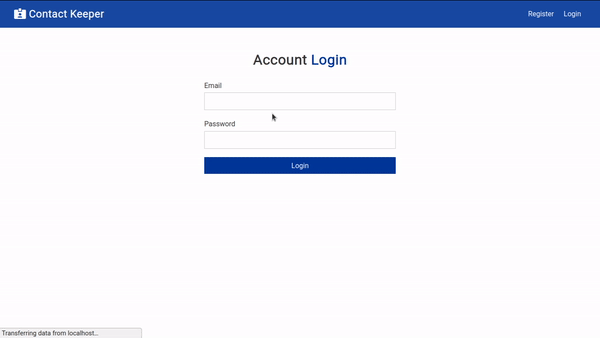

# Contact Keeper



## About This Project

This project was built by [Thiago Nunes Batista](https://www.linkedin.com/in/thiagonunesbatista), a Brazilian student in his journey to become a full stack web developer. If you want to take a look in his other projects, just open [this link](https://github.com/ThiagoNunesBatista?tab=repositories).

## What Is This Project About

Keep Track of Your Contacts, This project was developed during the course [React Front To Back](https://www.udemy.com/course/modern-react-front-to-back). It's a Full Stack application developed with React using React Hooks, Context Api and the Back End with NodeJS(Express) and MongoDB.

## Prerequisites

1. MongoDB Database
2. NPM

## How To Setup The Project

1. Enter in the desired project directory

2. Clone the repository

    ```bash
      git clone https://github.com/ThiagoNunesBatista/contact-keeper.git
    ```

3. Enter in the project folder and install dependencies

    ```bash
    cd contact-keeper && npm install
    ```

4. Modify the Mongo Url and JWT Secret in config/default.json to Match Your Database Settings and the desired JWT secret.

5. Start the project

    ```bash
    npm run dev
    ```

## LICENSE

This project is Open Source and is licensed under [MIT license](https://github.com/ThiagoNunesBatista/GuitiRub/blob/master/LICENSE). Feel free to do whatever you want with this code. If you want to contribute to this code, issues and pull requests are very welcome.
